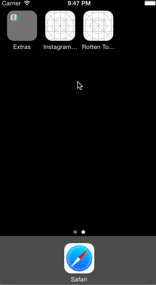

Hours: 6

Completed requirements:

- User can view a list of movies from Rotten Tomatoes. Poster images must be loading asynchronously.
- User can view movie details by tapping on a cell.
- User sees loading state while waiting for movies API.
- User sees error message when there's a networking error. You may not use UIAlertView or a 3rd party library to display the error. 
- User can pull to refresh the movie list.
- (optional) Add a search bar

Demo: 

